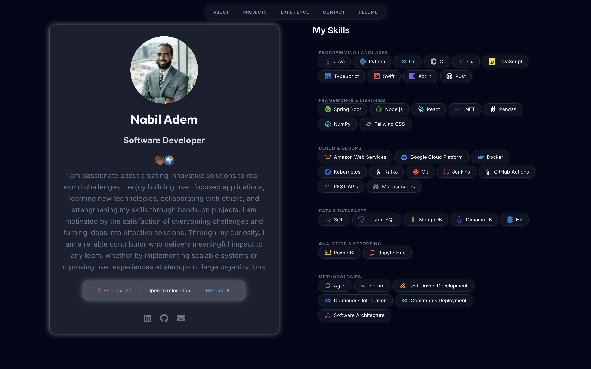

<div align="center">

# Nabil Adem's Portfolio

[](https://nabiladem.com)

Welcome to my personal website, showcasing my professional and personal journey in software development. View it here: [nabiladem.com](https://nabiladem.com).



</div>

## Tech Stack

-  
- 
- 

## Getting Started

1. **Clone the repository:**
   ```bash
   git clone https://github.com/nabiladem/portfolio.git
   cd portfolio
   ```

2. **Install dependencies:**
   Make sure you have Node.js installed. Then, run:
   ```bash
   npm install
   ```

3. **Start the development server:**
   ```bash
   npm run dev
   ```
   The application will be available at `http://localhost:5173`.

## Contributing

Since this is a personal website, I am not actively looking for code contributions. However, feedback, bug reports, and suggestions are always welcome! Feel free to open an issue or reach out through the website's contact form or via [email](mailto:adem.nabil00@gmail.com).